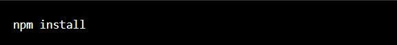
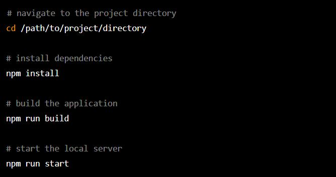
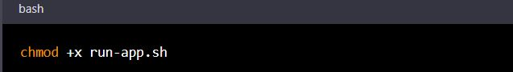
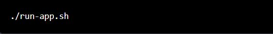

Expense Manager:

Expense Manager is a web application designed to help users keep track of their expenses and budgets. The frontend of the application is built using ReactJS, while the backend is built using NodeJS. The application uses normal api Fetch and Axios for data fetching, and custom CSS and Bootstrap for styling.

Features:

The following features are available in the application:

Signup, Login and Logout: Users can create an account, login to their account, and logout when they are done using the application.
Add expense: Users can add new expenses to their specified category of the expense.
Edit expense: Users can edit existing expenses, including the amount.
Delete expense: Users can soft delete expenses, which means the entry is not removed from the database but is indicated as deleted in the UI.
Expense and budget summary: Users can view a summary of their expenses and budgets, including the category.
Settings page: Users can set their budget plan on settings page, including the category,budget amount and date.
Expense and budget summary with chart: Users can view a barchart of their expenses and budgets, which provides a visual representation of their spending trend.

Installation:

To run the application, you will need to have NodeJS and a web browser installed on your computer. Follow these steps to install and run the application:

Clone the repository to your local machine.
Open a terminal window and navigate to the project directory.
Install the dependencies by running the following command: npm install
Start the application by running the following command: npm start
Open a web browser and navigate to http://localhost:3000 to view the application.
Usage

To use the application, follow these steps:

Signup or login to your account.
Add expenses to your account by clicking on the "Add Expense" button and filling out the form.
View and edit your expenses by clicking on the "Edit" button.
Soft delete expenses by clicking on the "Delete" button on the dashboard.
View your expense and budget summary on the dashboard page.
Setup your budget plan on the "Settings" page.

Getting Started :

To get started with the Expense Manager Application, you will need to follow these steps:

Prerequisites:

Node.js
NPM

Installation:

1.Clone the repository to your local machine.
2.Navigate to the project directory.
3.Install the dependencies by running the following command:

Runner Script:

Usage

To build and run the Expense Manager Application, you can use the runner shell script provided in the project. The script automates the entire build and execute process, so you don't have to run each command manually.

Create the runner shell script

To create a runner shell script, open a text editor and create a new file with a .sh file extension. You can name the file anything you want, but it's a good idea to choose a name that describes what the script does. For example, if your script builds and runs your application, you could name it "run-app.sh".

In the runner shell script, write the commands that you would normally use to build and run your application. For example, if your application is built with npm and runs on a local server, you might include the following commands:

To use the runner shell script, follow these steps:

1.Open your terminal and navigate to the root directory of the project.
2.Make the runner shell script executable by running the following command:

3.Run the script by typing the following command:

The script will execute the commands to install dependencies, build the application, and start the server. Once the server is running, you can access the application in your web browser by going to http://localhost:3000.
